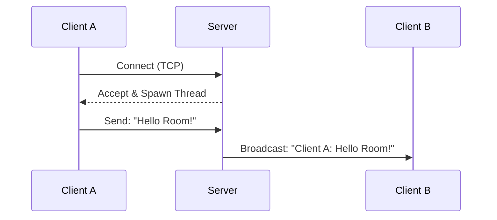

# 💬 Chat Room : Custom - Server

### 🏗️ System Architecture

## Tech Stacks used : 

1. Python 3.12
2. Python **Socket Module** (for connecting end nodes) [{click here}](https://realpython.com/python-sockets/)
3. Python **Threading Module** (for multithreading) [{click here}](https://realpython.com/intro-to-python-threading/)
4. Python **tkinter Module** (for Providing GUI) [{Click here}](https://youtube.com/playlist?list=PLu0W_9lII9ajLcqRcj4PoEihkukF_OTzA&si=d2chqVaFU95K4isR)

