<p align="center">
  
  <p> </p>

<p align="center">
  <strong>A multi-room, real-time chat application built from scratch with raw Python sockets, threading, and a Catppuccin-themed tkinter GUI.</strong>
</p>

<p align="center">
  
  
  
  
  
  
</p>

---

## 📑 Table of Contents

- [Overview](#-overview)
- [Features](#-features)
- [System Architecture](#-system-architecture)
- [Message Protocol](#-message-protocol)
- [Tech Stack](#-tech-stack)
- [Project Structure](#-project-structure)
- [Getting Started](#-getting-started)
  - [Prerequisites](#prerequisites)
  - [Installation](#installation)
  - [Running the Server](#1-start-the-server)
  - [Running the Client](#2-launch-the-client)
- [Remote Access with Pinggy](#-remote-access-with-pinggy)
- [Chat History & Persistence](#-chat-history--persistence)
- [Screenshots](#-screenshots)
- [Contributing](#-contributing)
- [Team Members](#-team-members)
- [License](#-license)

---

## 🔭 Overview

**Chat Room** is a TCP-based, multi-room chat system designed to understand low-level networking concepts in Python. It uses **raw sockets** (no HTTP, no WebSockets, no frameworks) with **one thread per client** for concurrent handling, and a **dictionary-keyed room system** that isolates conversations by a 4-digit room code.

Users connect through a polished **tkinter desktop client** with a Catppuccin Mocha dark theme, and can optionally expose the server to the internet using **Pinggy** reverse tunnels — no port forwarding or static IP required.

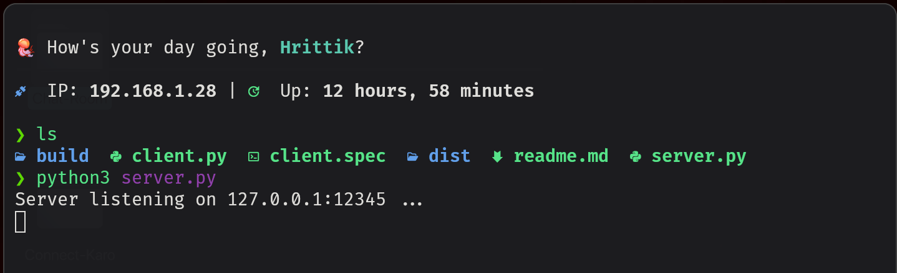

---

## ✨ Features

| Feature | Description |
|:---|:---|
| **🏠 Room-Based Isolation** | Users join rooms via a **4-digit numeric code**. Messages are broadcast only within the same room — other rooms receive nothing. |
| **👥 Multi-User Concurrency** | Each client connection spawns a dedicated **daemon thread**, allowing unlimited simultaneous users across multiple rooms. |
| **📜 Persistent Chat History** | Every message is appended to `room_XXXX.txt`. When a new user joins, the server streams the full history so they can catch up on past conversations. |
| **🌐 Remote Access** | Expose the local server to the internet with a single **Pinggy SSH tunnel** command — perfect for chatting with friends on different networks. |
| **🎨 Catppuccin Dark UI** | The client features a sleek **Catppuccin Mocha** color palette with color-coded messages: blue for self, green for system events, red for errors. |
| **🔄 Leave & Rejoin** | Users can leave a room and join a different one (or the same one) without restarting the client. |
| **✅ Input Validation** | Both client and server enforce that room codes must be **exactly 4 digits** and usernames must be **non-empty**. |
| **🧹 Graceful Cleanup** | Closing the window or clicking "Leave" properly disconnects the socket, notifies other users, and removes the client from the server's room registry. |

<p align="center">
  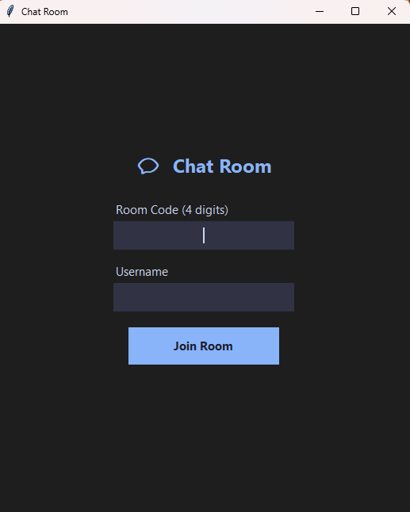
  &nbsp;&nbsp;&nbsp;
  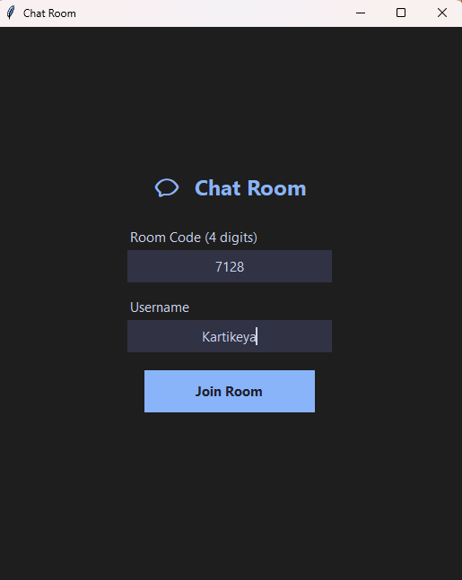
</p>
<p align="center"><em>Client login screen — enter a 4-digit room code and a username to join</em></p>

---

## 🏗️ System Architecture

The server maintains a central **rooms dictionary**: `{room_code: [(socket, username), ...]}`. When a message arrives from a client, the server looks up all sockets mapped to that room code and broadcasts the message to each one, excluding the sender.

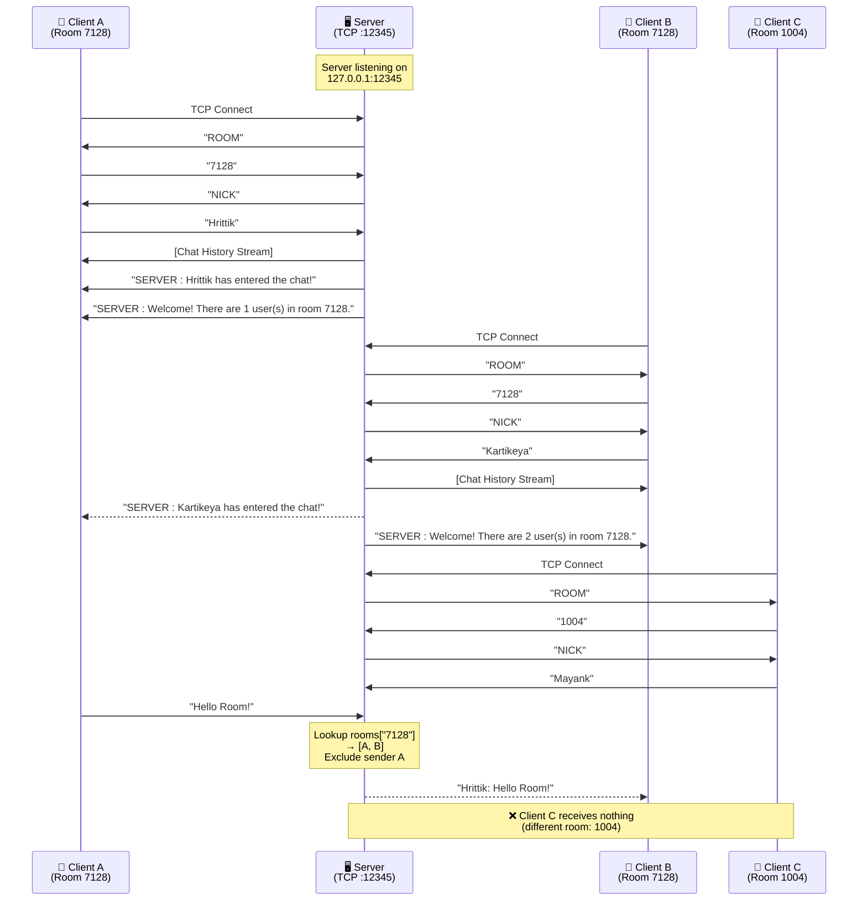

### Room Dictionary — Internal State

```
rooms = {
    "7128": [
        (socket_A, "Hrittik"),
        (socket_B, "Kartikeya")
    ],
    "1004": [
        (socket_C, "Mayank")
        (socket_D, "Priya")
    ]
}
```

Thread safety is ensured with a `threading.Lock()` (`rooms_lock`) that guards all reads and writes to the `rooms` dictionary.

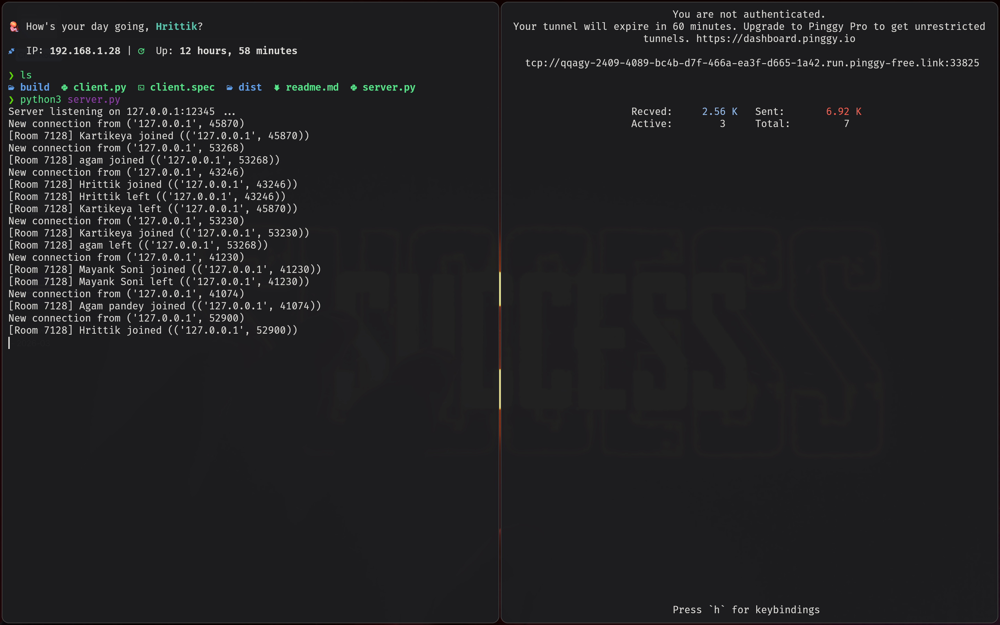

---

## 📡 Message Protocol

This application uses a **custom text-based protocol** over raw TCP. There are no length headers or delimiters — all data is sent as **UTF-8 encoded strings**.

### Phase 1 — Handshake (Connection Setup)

| Step | Direction | Payload | Purpose |
|:---:|:---:|:---|:---|
| 1 | `Server → Client` | `ROOM` | Server requests the room code |
| 2 | `Client → Server` | `7128` | Client sends a 4-digit room code |
| 3 | `Server → Client` | `NICK` | Server requests the username |
| 4 | `Client → Server` | `Hrittik` | Client sends the chosen username |

**Validation rules** (enforced server-side):
- Room code must be **exactly 4 characters**, all digits (`isdigit()`)
- Username must be **non-empty** after `.strip()`
- On failure, the server sends `ERROR : <reason>` and closes the socket

### Phase 2 — History Replay

After a successful handshake, the server reads `room_XXXX.txt` and sends the **entire file contents** in a single `send()` call. The client displays this as green system text.

### Phase 3 — Message Loop

| Direction | Raw Bytes Sent | Display Format |
|:---:|:---|:---|
| `Client → Server` | `msg.encode('utf-8')` | Raw message text only (e.g., `Hello!`) |
| `Server → Room` | `f"{username}: {message}".encode('utf-8')` | Server prepends the sender's username |

**Key detail**: The client sends **only the message body**. The server attaches the username before broadcasting. The sender displays the message locally with their own username prefix (in blue), so they see it immediately without waiting for a round-trip.

```python
# Client side — sends raw text only
self.sock.send(msg.encode('utf-8'))
self.display_message(f"{self.username}: {msg}", tag="self")

# Server side — attaches username before broadcast
formatted_message = f"{username}: {message}"
broadcast(formatted_message, room_code, exclude=client_sock)
```

### System Events

The server broadcasts system events with the `SERVER :` prefix:

| Event | Message Format |
|:---|:---|
| User joins | `SERVER : {username} has entered the chat!` |
| User leaves | `SERVER : {username} has left the chat!` |
| Welcome | `SERVER : Welcome! There are {n} user(s) in room {code}.` |

The client detects these by checking if the message contains `"SERVER :"` or starts with `"---"`, and renders them in **green** (`#a6e3a1`).

---

## 🛠️ Tech Stack

| Layer           | Technology                        | Role                                       |
| :-------------- | :-------------------------------- | :----------------------------------------- |
| **Networking**  | Python `socket`                   | Raw TCP client/server communication        |
| **Concurrency** | Python `threading`                | One daemon thread per connected client     |
| **GUI**         | Python `tkinter` + `scrolledtext` | Desktop client with login and chat views   |
| **Persistence** | Flat text files (`room_XXXX.txt`) | Append-only chat history per room          |
| **Packaging**   | PyInstaller (`client.spec`)       | One-file `.exe` distribution for Windows   |
| **Tunneling**   | Pinggy (SSH reverse tunnel)       | Expose local server to the public internet |

---

## 📂 Project Structure

```
Chat-Room/
├── server.py            # TCP server — room management, broadcast, history
├── client.py            # tkinter GUI client — login screen, chat screen, networking
├── client.spec          # PyInstaller spec for building a one-file .exe
├── readme.md            # This file
├── screenshots/         # Application screenshots
│   ├── 01_server_startup.png
│   ├── 02_pinggy_tunnel.png
│   ├── ...
│   └── 13_server_shutdown_and_tunnel_timeout.png
├── build/               # PyInstaller build intermediates
├── dist/
│   └── client.exe       # Compiled Windows executable (~11 MB)
└── .venv/               # Python virtual environment
```

---

## 🚀 Getting Started

### Prerequisites

- **Python 3.8+** (developed and tested on **3.12**)
- **tkinter** — typically included with Python. On Debian/Ubuntu:
  ```bash
  sudo apt install python3-tk
  ```
- No third-party packages required — the entire project uses the **Python standard library**

### Installation

```bash
# Clone the repository
git clone https://github.com/hrittik702/Chat-Room.git
cd Chat-Room
```

### 1. Start the Server

```bash
python3 server.py
```

The server binds to `127.0.0.1:12345` and begins accepting connections:

```
Server listening on 127.0.0.1:12345 ...
```

> **Tip:** The server runs indefinitely. Press `Ctrl+C` to gracefully shut down.

### 2. Launch the Client

```bash
python3 client.py
```

> **For local testing**, update `HOST` and `PORT` in `client.py` to match the server:
> ```python
> HOST = '127.0.0.1'
> PORT = 12345
> ```

### 3. Join a Room

1. Enter a **4-digit room code** (e.g., `7128`)
2. Enter a **username** (e.g., `Hrittik`)
3. Click **Join Room** or press `Enter`

You're now in the chat. Open multiple client instances to simulate a group conversation.

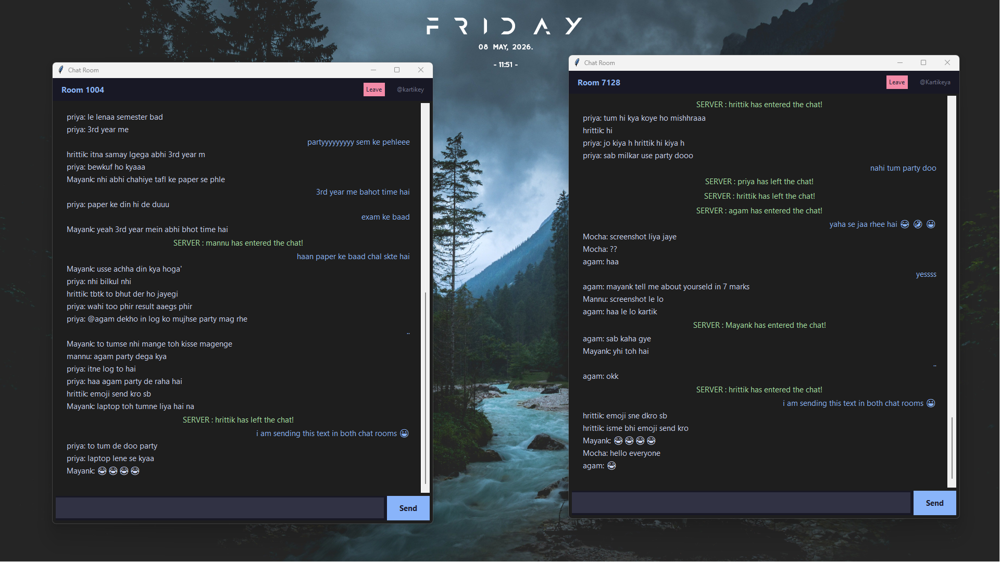

### 4. Pre-built Executable (Windows)

A pre-compiled `client.exe` is available in the `dist/` folder. No Python installation needed — just double-click and connect.

---

## 🌐 Remote Access with Pinggy

To let friends on **different networks** connect to your server, use [Pinggy](https://pinggy.io) to create a TCP tunnel.

### Step 1 — Start the Server Locally

```bash
python3 server.py
# → Server listening on 127.0.0.1:12345 ...
```

### Step 2 — Create the Tunnel

In a **separate terminal**, run:

```bash
ssh -p 443 -R0:localhost:12345 a.pinggy.io tcp
```

Pinggy will output a public TCP address:

```
tcp://xxxxxx.run.pinggy-free.link:33825
```

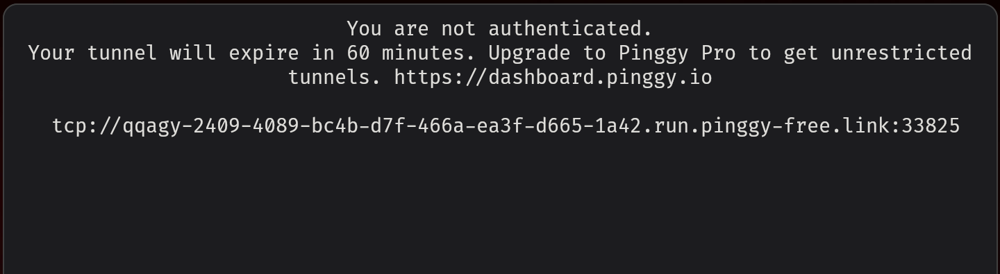

### Step 3 — Configure the Client

Update `HOST` and `PORT` in `client.py` (line 7–8) with the Pinggy URL:

```python
HOST = 'xxxxxx.run.pinggy-free.link'  # Your Pinggy hostname
PORT = 33825                           # Your Pinggy port
```

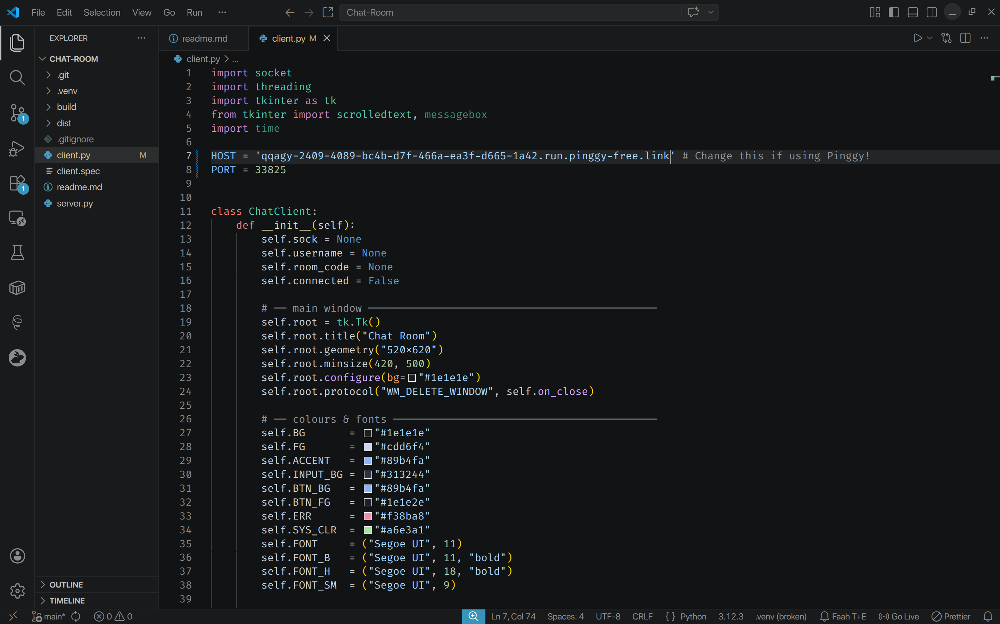

### Step 4 — Share & Chat

Send the compiled `client.exe` (from `dist/`) to your friends. They can now connect to your server from **anywhere in the world**.

> **Note:** Free Pinggy tunnels expire after **60 minutes**. For persistent tunnels, consider [Pinggy Pro](https://dashboard.pinggy.io).

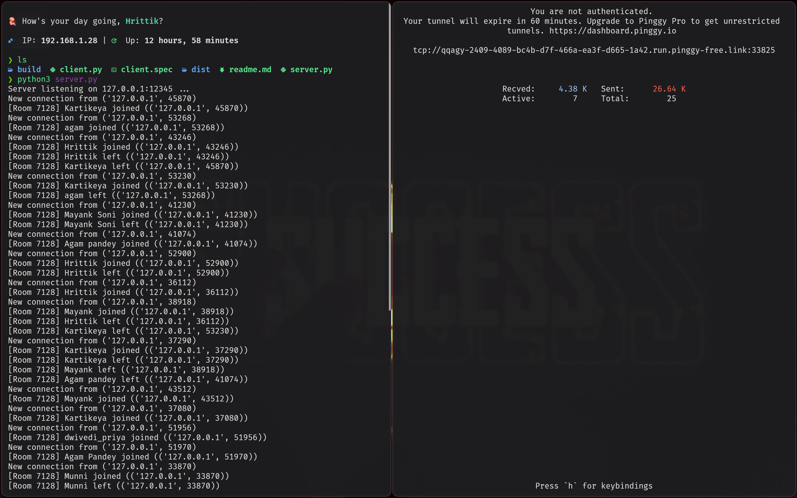

---

## 📜 Chat History & Persistence

Every message broadcast to a room is **appended** to a flat text file named `room_XXXX.txt` (where `XXXX` is the room code). When a new user joins, the server reads this file and streams it to the client before any new messages arrive.

### How It Works

1. **Room created** → server creates `room_XXXX.txt` with a header line
2. **Message sent** → server appends `username: message\n` to the file
3. **User joins** → server reads the file and sends the full contents
4. **Result** → new users see the complete conversation history

<p align="center">
  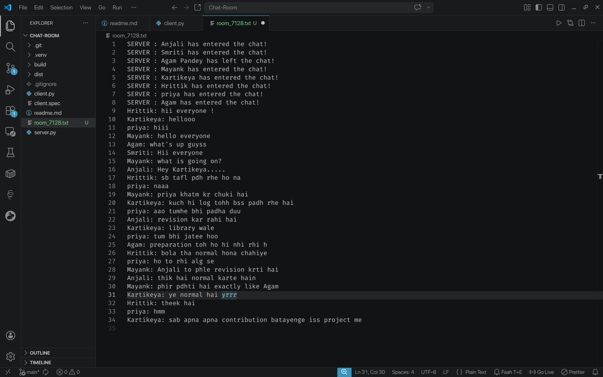
</p>
<p align="center"><em>The <code>room_7128.txt</code> file — every message persisted as plain text</em></p>

### Multiple Rooms in Action

The room dictionary supports **unlimited concurrent rooms**. Each room maintains its own independent history file and member list.

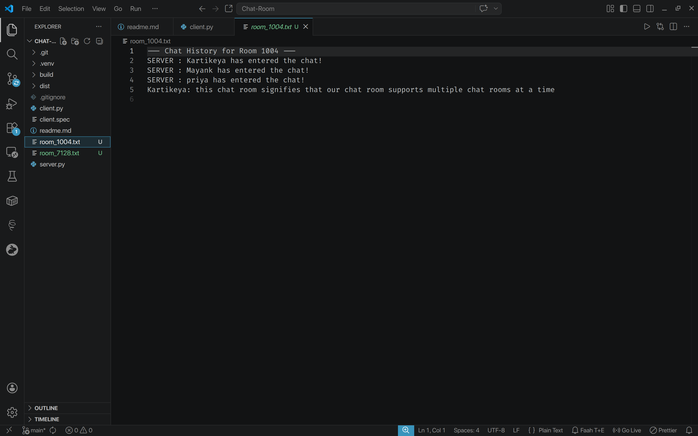
<p align="center"><em>Two rooms running in parallel — Room 1004 (left) and Room 7128 (right) with fully isolated conversations</em></p>

The file explorer confirms both `room_1004.txt` and `room_7128.txt` are created and maintained independently:

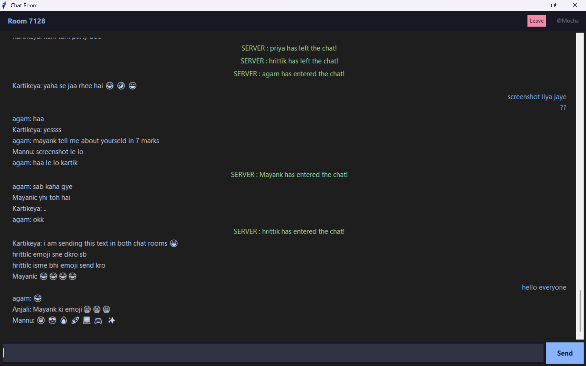

---

## 📸 Screenshots

<details>
<summary><b>🖥️ Server Startup</b></summary>
<br/>


The server binds to `127.0.0.1:12345` and waits for incoming TCP connections.

</details>

<details>
<summary><b>🔗 Pinggy Tunnel</b></summary>
<br/>


A reverse SSH tunnel through Pinggy exposes the local server with a public hostname and port.

</details>

<details>
<summary><b>🔑 Client Login</b></summary>
<br/>

<p align="center">
  
  &nbsp;&nbsp;
  
</p>

The Catppuccin-themed login screen with room code and username fields.

</details>

<details>
<summary><b>💬 Live Group Chat</b></summary>
<br/>


Real-time group conversation in Room 7128 with color-coded messages.

</details>

<details>
<summary><b>🏠 Multiple Rooms</b></summary>
<br/>


Room 1004 and Room 7128 running in parallel with fully isolated message streams.

</details>

<details>
<summary><b>📊 Server Logs (Extended Session)</b></summary>
<br/>


Server handling 25+ connections with real-time join/leave tracking across multiple rooms.

</details>

<details>
<summary><b>📜 Chat History Persistence</b></summary>
<br/>


Every message is persisted to `room_XXXX.txt` for history replay on rejoin.

</details>

<details>
<summary><b>🛑 Server Shutdown & Tunnel Timeout</b></summary>
<br/>

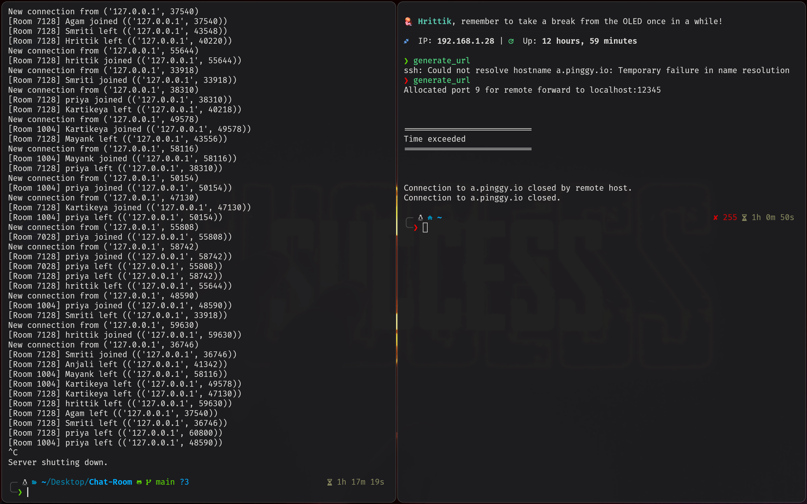

Graceful `Ctrl+C` shutdown on the server side, and Pinggy free tunnel expiring after 60 minutes.

</details>

---

## 🤝 Contributing

Contributions are welcome! Here are some ideas for improvement:

- [ ] **Message framing** — Add length-prefix headers to handle TCP stream boundaries
- [ ] **TLS encryption** — Wrap sockets with Python's `ssl` module
- [ ] **Room passwords** — Optional password protection for private rooms
- [ ] **Configurable HOST/PORT** — Accept server address via CLI arguments or a config file
- [ ] **Typing indicators** — Broadcast `"user is typing..."` events
- [ ] **Private messaging** — `/dm username message` command support
- [ ] **SQLite persistence** — Replace flat files with a proper database

```bash
# Fork, branch, and submit a PR
git checkout -b feature/your-feature
git commit -m "Add your feature"
git push origin feature/your-feature
```

---

## 👥 Team Members

This project was built collaboratively by a team of **8 members** from [Rajkiya Engineering College, Ambedkar Nagar](https://recabn.ac.in/).

<table align="center">
  <tr>
    <td align="center" width="150">
      <br />
      <b>Hrittik Maurya</b><br />
      <b>2407370130032</b>
    </td>
    <td align="center" width="150">
      <br />
      <b>Agam Pandey</b><br />
      <b>2407370130007</b>
    </td>
    <td align="center" width="150">
      <br />
      <b>Kartikeya Mishra</b>
    </td>
    <td align="center" width="150">
      <br />
      <b>Mayank Soni</b><br />
      <b>2407370130038</b>
    </td>
  </tr>
  <tr>
    <td align="center" width="150">
      <br />
      <b>Manvendra Singh</b><br />
      <b>2407370130037</b>
    </td>
    <td align="center" width="150">
      <br />
      <b>Priya Dwivedi</b>
    </td>
    <td align="center" width="150">
      <br />
      <b>Anjali Saroj</b><br />
      <b>2407370130017</b>
    </td>
    <td align="center" width="150">
      <br />
      <b>Smriti Maurya</b>
    </td>
  </tr>
</table>

<p align="center"><em>B.Tech IT — Rajkiya Engineering College, Ambedkar Nagar</em></p>

---

## 📄 License

This project is open source and available under the [Rajkiya Engineering College, Ambedkar Nagar](https://recabn.ac.in/)

---

<p align="center">
  Built with Team ❤️ using nothing but the <strong>Python Standard Library</strong>
</p>
